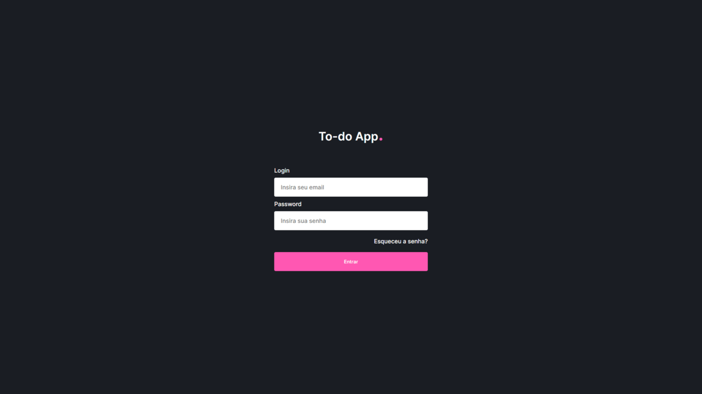

# 📖 Projeto

Este projeto é resultado de um teste técnico que consiste em consumir uma API Rest, realizar a autenticação do usuário (persistindo os cookies) e prover as funcionalidades de CRUD de tarefas.

## 🧪 Tecnologias

 [](https://skillicons.dev)

## 🚀 Como executar

Para inicializar o projeto localmente siga os passos descritos abaixo:

```bash
# Clone o repositório
$ git clone https://github.com/d0ugui/flimed.git

# Entre no repositório
$ cd flimed

# Instale as dependências
$ npm install or yarn

# Execute a aplicação
$ npm run dev or yarn dev

# O aplicação inciará na porta:3000 - acesse <http://localhost:3000>
```

## 📝 License

Esse projeto está sob a licença MIT.